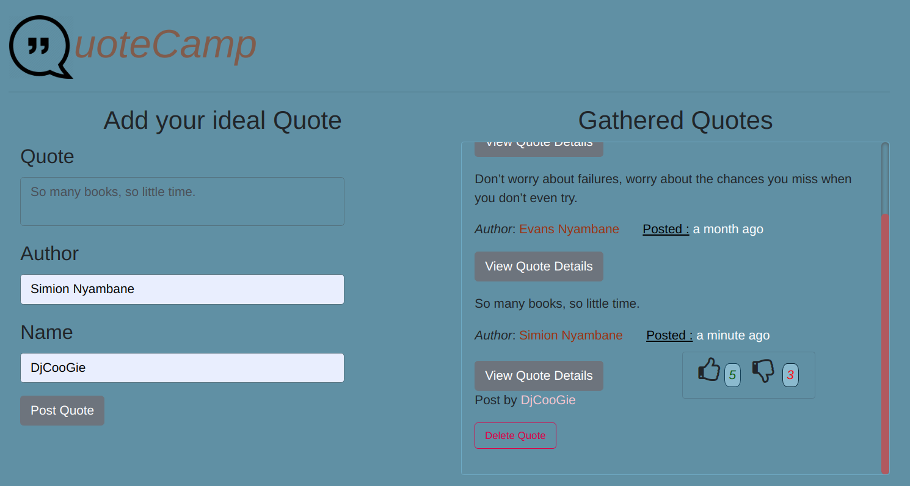

# _QuoteCamp_
QuoteCamp is an Angular Web App that allows users to read motivational and inspirational quotes, and add their favorite quotes to the app. Also, it allows users to up-vote or down-quote each quote.

## Author
**Evans Nyambane** 

### QuoteCamp

### Setup and installation requirements
- ` git clone https://github.com/jusinam/QuoteCamp.git `
- Extract the file into your preferred location
- Navigate to the files via the terminal.
- While on terminal, `npm install` to download prerequisites and  ` ng serve -o ` or ` npm start ` to open the app in your browser

### Languages used
1. Javascript-Node 
2. HTML & CSS (Bootstrap)
3. Angular 8

### BDD
1. 
| Behavior |
| -------- |
| The page loads  | 
| Adding quote form |
| Upvoting and downvoting quotes |
| Delete  quotes |

2. 
| Inpage actions |
| -------------- |
| User inputs quote, author and his/her name |
| User clicks on either the upvoting or downvoting buttons | 
| The user clicks the delete quote button |
3. 
| Output |
| ------ |
| The quote is added to the custom quotes |
| User is able to access and read through the existing quotes |
| The number of upvotes/downvotes increases by one | 
| The quote is deleted from the quotes |

### Live link: [https://jusinam.github.io//](https://jusinam.github.io//)

### Bugs
No known bugs

### Support and contact details
Incase of any questions, problems ideas concerning the website, feel free to reach out to me via email.(evansonchagwa01@gmail.com)

#### License

***MIT LICENSE***

Copyright &copy; 2019 **Evans Nyambane**

Permission is hereby granted, free of charge, to any person obtaining a copy
of this software and associated documentation files (the "Software"), to deal
in the Software without restriction, including without limitation the rights
to use, copy, modify, merge, publish, distribute, sublicense, and/or sell
copies of the Software, and to permit persons to whom the Software is
furnished to do so, subject to the following conditions:
The above copyright notice and this permission notice shall be included in all
copies or substantial portions of the Software.
THE SOFTWARE IS PROVIDED "AS IS", WITHOUT WARRANTY OF ANY KIND, EXPRESS OR
IMPLIED, INCLUDING BUT NOT LIMITED TO THE WARRANTIES OF MERCHANTABILITY,
FITNESS FOR A PARTICULAR PURPOSE AND NONINFRINGEMENT. IN NO EVENT SHALL THE
AUTHORS OR COPYRIGHT HOLDERS BE LIABLE FOR ANY CLAIM, DAMAGES OR OTHER
LIABILITY, WHETHER IN AN ACTION OF CONTRACT, TORT OR OTHERWISE, ARISING FROM,
OUT OF OR IN CONNECTION WITH THE SOFTWARE OR THE USE OR OTHER DEALINGS IN THE
SOFTWARE.